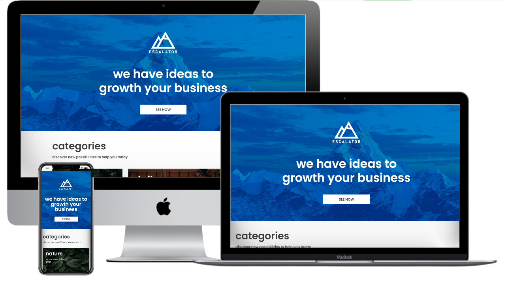

# Desafio Front-end Júnior - Codeby



<p align="center">
  <a href="#rocket-objective">Objetivo</a>&nbsp;&nbsp;&nbsp;|&nbsp;&nbsp;&nbsp;
  <a href="#rocket-technologies">Tecnologias</a>&nbsp;&nbsp;&nbsp;|&nbsp;&nbsp;&nbsp;
  <a href="#information_source-how-to-use">Como Executar?</a>&nbsp;&nbsp;&nbsp;
</p>

## :information_source: Objetivo

Desenvolver o Front-End de um layout usando Flex-Box CSS e suas propriedades.

Requisitos mínimos:

- Usar Flex-Box CSS.
- Resolução Desktop.
- Enviar o link do teste no github.

## :rocket: Tecnologias

Foram utilizadas as seguintes tecnologias no mesmo:

- HTML5
- CSS3

## :information_source: Como executar?

Para clonar o diretório é necessário ter o git instalado.

```bash
# Clone this repository
$ git clone https://github.com/glaubersabino/tfej-codeby

# Go into the repository
$ cd tfej-codeby

# Run the app
$ index.html
```
